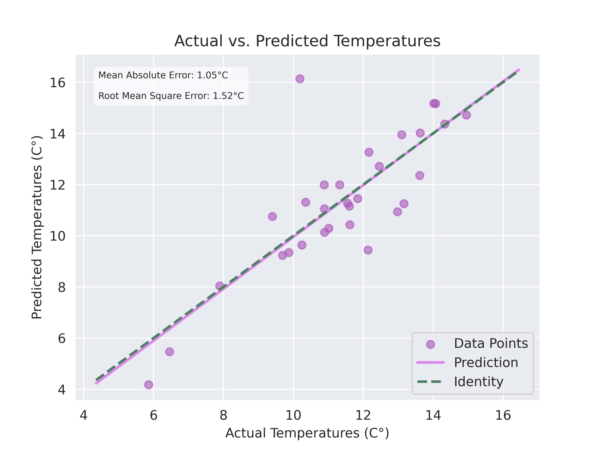

## Weather Prediction Model Project
This project, developed for the EHB420 Artificial Neural Networks course, focuses on creating a robust regression model to predict daily temperatures in Istanbul during November 2024. The model utilizes atmospheric data from the preceding three days to predict the average daily temperature, sourced via the OpenWeather API.

The dataset spans the year leading up to December 2024 and includes parameters such as `temperature`, `wind speed` (transformed into Cartesian components), `humidity`, and `pressure`. Preprocessing steps included normalization and sequence creation, structuring the data into three-day windows to capture temporal dependencies effectively. Unnecessary features, such as `min_temperature`, `max_temperature`, and `feels_like`, were excluded to enhance the model's predictive accuracy and avoid collinearity issues.

Model development progressed iteratively, beginning with simple dense networks and evolving into a sophisticated Long Short-Term Memory (LSTM) architecture. The final model architecture includes:

An LSTM layer with 64 units to capture long-term patterns, fully connected dense layers to refine feature extraction, and a single-output layer for temperature prediction. The trained model achieved strong predictive performance, with a Mean Absolute Error (MAE) of 1.05°C and a Root Mean Square Error (RMSE) of 1.52°C. Permutation importance analysis highlighted `temperature`, `wind`, `pressure`, and `humidity` as the most critical features influencing predictions.



### Installation
#### Prerequisites
* Docker (for containerized TensorFlow environment)
* Recommended: NVIDIA GPU and NVIDIA Container Toolkit (for GPU acceleration)

#### Setting Up the Environment
##### Clone the Repository:
```shell
git clone https://github.com/buorq3io/weather-forecast.git
```

##### Build the Docker Tensorflow Image
```shell
cd weather-forecast && docker build -t weather-prediction .
```

##### Download Dataset:
Once the `OPEN_WEATHER_API_KEY` environment variable has been set,
the data will be fetched and saved to the `/data` directory 
the first time either `get_data()` or `get_data_train_test_split()` functions are called.
Delete the generated files to fetch again in case of an error.

### Usage
##### Run tensorflow image:
```shell
docker run -v ~/path-to-project/weather-forecast:/opt/project -it --env TF_CPP_MIN_LOG_LEVEL=3 --rm --gpus all weather-forecast bash
cd /opt/project && export OPEN_WEATHER_API_KEY=your-api-key
```

##### See the model architecture (Optional):
```shell
python3 model.py
```

##### Train the model:
```shell
python3 train.py
```

##### Evaluate the model:
```shell
python3 predict.py
```

##### Or use a jupyter notebook (Alternative):
Use the `workshop.ipynb` file to connect to the container using the started jupyter server.
```shell
docker run -p 8888:8888 -p 6006:6006 -v ~/path-to-project/weather-forecast:/opt/project --env TF_CPP_MIN_LOG_LEVEL=3 --rm --gpus all weather-forecast
```

### Additional Models and Visualizations
Two trained models are included in the models/ directory. Their corresponding generated figures, including visualizations of prediction performance and feature importance, can be found in the figures/ directory.
